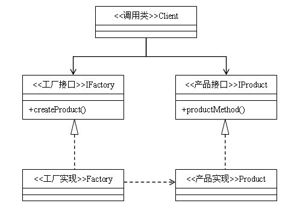
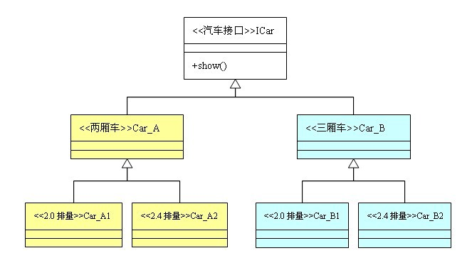

# 23 种设计模式 抽象工厂模式

**定义：**为创建一组相关或相互依赖的对象提供一个接口，而且无需指定他们的具体类。

**类型：**创建类模式

**类图：**



**抽象工厂模式与工厂方法模式的区别**

抽象工厂模式是工厂方法模式的升级版本，他用来创建一组相关或者相互依赖的对象。他与工厂方法模式的区别就在于，工厂方法模式针对的是一个产品等级结构；而抽象工厂模式则是针对的多个产品等级结构。在编程中，通常一个产品结构，表现为一个接口或者抽象类，也就是说，工厂方法模式提供的所有产品都是衍生自同一个接口或抽象类，而抽象工厂模式所提供的产品则是衍生自不同的接口或抽象类。

在抽象工厂模式中，有一个**产品族**的概念：所谓的产品族，是指**位于不同产品等级结构中功能相关联的产品组成的家族**。抽象工厂模式所提供的一系列产品就组成一个产品族；而工厂方法提供的一系列产品称为一个等级结构。我们依然拿生产汽车的例子来说明他们之间的区别。



在上面的类图中，两厢车和三厢车称为两个不同的等级结构；而2.0排量车和2.4排量车则称为两个不同的产品族。再具体一点，2.0排量两厢车和2.4排量两厢车属于同一个等级结构，2.0排量三厢车和2.4排量三厢车属于另一个等级结构；而2.0排量两厢车和2.0排量三厢车属于同一个产品族，2.4排量两厢车和2.4排量三厢车属于另一个产品族。

明白了等级结构和产品族的概念，就理解工厂方法模式和抽象工厂模式的区别了，如果工厂的产品全部属于同一个等级结构，则属于工厂方法模式；如果工厂的产品来自多个等级结构，则属于抽象工厂模式。在本例中，如果一个工厂模式提供2.0排量两厢车和2.4排量两厢车，那么他属于工厂方法模式；如果一个工厂模式是提供2.4排量两厢车和2.4排量三厢车两个产品，那么这个工厂模式就是抽象工厂模式，因为他提供的产品是分属两个不同的等级结构。当然，如果一个工厂提供全部四种车型的产品，因为产品分属两个等级结构，他当然也属于抽象工厂模式了。

**抽象工厂模式代码**

```
    interface IProduct1 {
    	public void show();
    }
    interface IProduct2 {
    	public void show();
    }

    class Product1 implements IProduct1 {
    	public void show() {
    		System.out.println("这是1型产品");
    	}
    }
    class Product2 implements IProduct2 {
    	public void show() {
    		System.out.println("这是2型产品");
    	}
    }

    interface IFactory {
    	public IProduct1 createProduct1();
    	public IProduct2 createProduct2();
    }
    class Factory implements IFactory{
    	public IProduct1 createProduct1() {
    		return new Product1();
    	}
    	public IProduct2 createProduct2() {
    		return new Product2();
    	}
    }

    public class Client {
    	public static void main(String[] args){
    		IFactory factory = new Factory();
    		factory.createProduct1().show();
    		factory.createProduct2().show();
    	}
    }
```

**抽象工厂模式的优点**

抽象工厂模式除了具有工厂方法模式的优点外，最主要的优点就是可以在类的内部对产品族进行约束。所谓的产品族，一般或多或少的都存在一定的关联，抽象工厂模式就可以在类内部对产品族的关联关系进行定义和描述，而不必专门引入一个新的类来进行管理。

 

**抽象工厂模式的缺点**

产品族的扩展将是一件十分费力的事情，假如产品族中需要增加一个新的产品，则几乎所有的工厂类都需要进行修改。所以使用抽象工厂模式时，对产品等级结构的划分是非常重要的。

 

**适用场景**

当需要创建的对象是一系列相互关联或相互依赖的产品族时，便可以使用抽象工厂模式。说的更明白一点，就是一个继承体系中，如果存在着多个等级结构（即存在着多个抽象类），并且分属各个等级结构中的实现类之间存在着一定的关联或者约束，就可以使用抽象工厂模式。假如各个等级结构中的实现类之间不存在关联或约束，则使用多个独立的工厂来对产品进行创建，则更合适一点。

 

**总结**

无论是简单工厂模式，工厂方法模式，还是抽象工厂模式，他们都属于工厂模式，在形式和特点上也是极为相似的，他们的最终目的都是为了解耦。在使用时，我们不必去在意这个模式到底工厂方法模式还是抽象工厂模式，因为他们之间的演变常常是令人琢磨不透的。经常你会发现，明明使用的工厂方法模式，当新需求来临，稍加修改，加入了一个新方法后，由于类中的产品构成了不同等级结构中的产品族，它就变成抽象工厂模式了；而对于抽象工厂模式，当减少一个方法使的提供的产品不再构成产品族之后，它就演变成了工厂方法模式。

所以，在使用工厂模式时，只需要关心降低耦合度的目的是否达到了。
